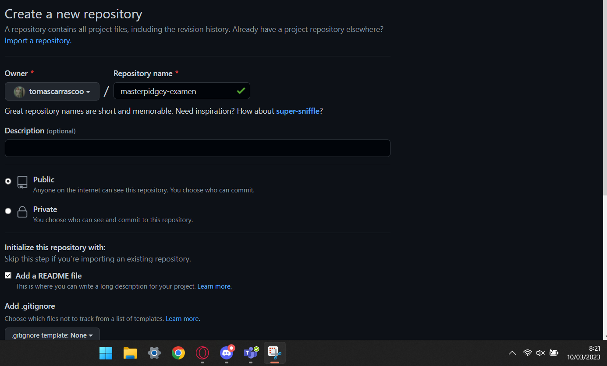

<h1 align="center"> # EXAMEN 2 EVALUACION ENTORNOS DE DESARROLLO </h1>

***

### PARTE 1:
- 1.-Clonar repositorio en local: 'git clone'.

* 2.-Añadir comandos al README: 'nano README.md'.
* 3.-Realizar un commit inicial: 'git commit -m "commit incial"'.
* 4.-Push incial: 'git add README.md', 'git push'.
* 5.-Crear carpeta y archivo de texto: 'touch privado.txt', 'mkdir privada'.
* 6.-Hacer el archivo y carpeta ocultos: 'touch .gitignore' 'nano .gitignore' y escribimos el nombre de los archvios y carpetas dentro.
* 7.-Añadir 1.txt: 'touch '1.txt''.
* 8.-Ver commits realizados hasta el momento: 'git log'.
* 9.-Crear tag: 'git tag -a v0.1'
* 10.-Subir los cambios al repositorio: 'git commit', 'git push origin main'.
* 11.-Visualizar de nuevo historial de commit: 'git log'.
* 12.-Crear una tabla:

|       NOMBRE           |                  GITHUB                 |
| ---------------------  | --------------------------------------- | 
| Maximo Fernandez Riera | https://github.com/maximofernandezriera |

***

### PARTE 2:
* 1.-Clonar repositorio: 'git clone'
* 2.-Crear una rama: 'git checkout -b add-tomas-carrasco'
* 3.-Agregar mi nombre al Contributors: 'nano Contributors.md'
* 4.-Hacer commit: 'git add Contributors.md', 'git commit'
* 5.-Hacer push: 'git push origin add-tomas-carrasco'
